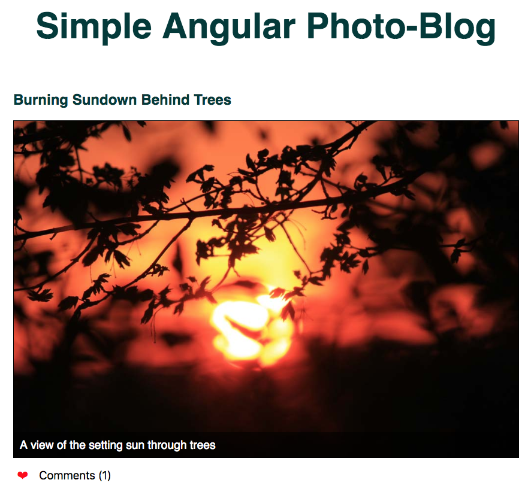
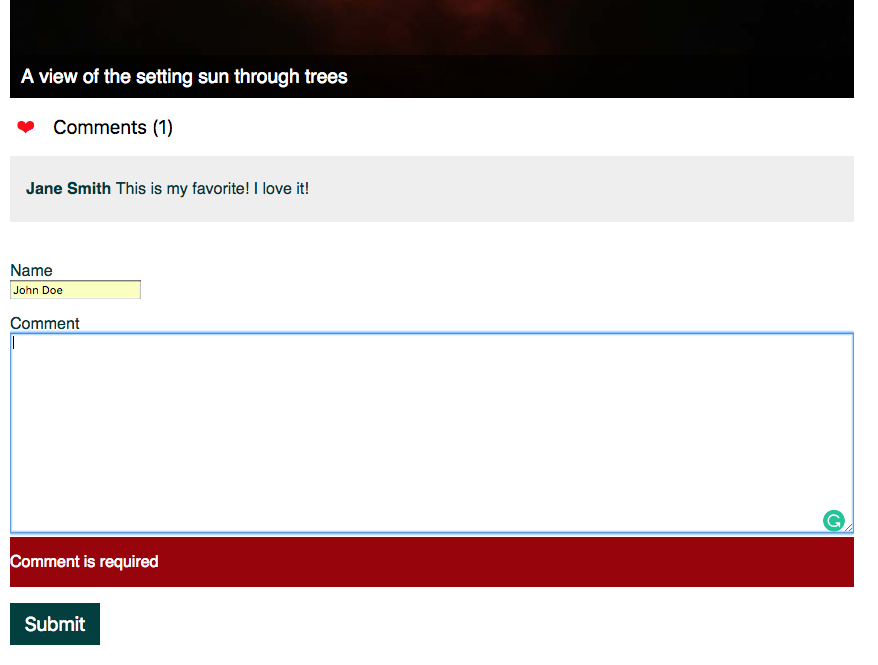

# Simple Angular Photo Blog

## Features

- Load Entries
- Display Entries
- Add Like and Count them
- Add Comment
- Validate Form with positive and negative User-Feedback (Angular sided)
  
Based on the Treehouse Course
[Angular Basics](https://teamtreehouse.com/library/angular-basics-2)

Using the mock-up [Angular in-memory-web-api](https://github.com/angular/in-memory-web-api)

## How to run

1. Clone the repository
2. `cd` into the projects root dir
3. Run `npm install` or `yarn install`
4. Start the server `npm run serve` or `yarn run serve`
5. Open up your browser and navigate to `http://localhost:8080/`

